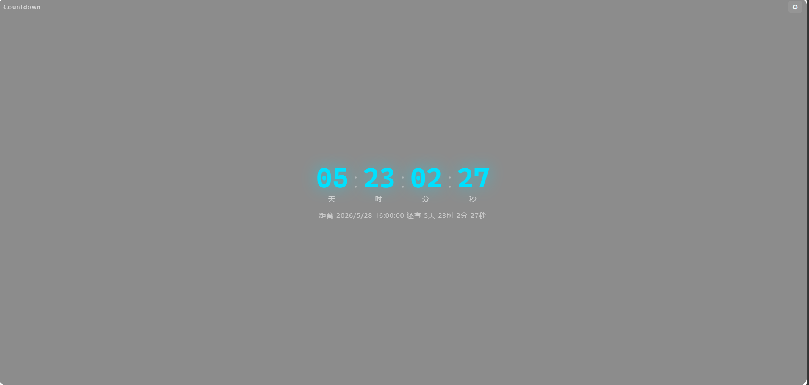
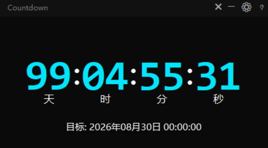

# Desktop Countdown Widget · 桌面倒计时小工具

一个精致的桌面倒计时小工具，无边框设计，支持自定义背景图片和颜色主题。

## 效果预览


- 无边框窗口，可拖拽移动
- 实时显示 天 / 时 / 分 / 秒
- 支持自定义背景图片 + 暗色叠加层
- 文字颜色、强调色自由调整
- 支持窗口置顶，始终可见

## 快速开始

### 方式一：一键启动 (Windows)

双击 `start.bat`，自动检测环境并安装依赖。

### 方式二：命令行启动

```bash
pip install -r requirements.txt

python countdown_widget.py
```

### 方式三：浏览器版本

直接用浏览器打开 `index.html`，无需安装任何依赖。

## 功能说明

| 功能 | 操作 |
|------|------|
| 移动窗口 | 拖拽标题栏 |
| 设置 | 点击标题栏 ⚙ 按钮，或右键菜单 |
| 置顶 | 点击 📍 按钮切换窗口置顶 |
| 最小化 | 点击 ─ 按钮 |
| 关闭 | 点击 ✕ 按钮 |
| 右键菜单 | 右键点击窗口任意位置 |

### 设置项

- **目标日期** — 支持手动输入 (YYYY-MM-DD HH:MM:SS) 或快速预设 (1/7/30/100/365 天)
- **文字颜色** — 标签文字的颜色
- **强调色** — 倒计时数字的颜色
- **背景图片** — 选择本地图片作为背景，支持 PNG/JPG/GIF/WebP/BMP
- **背景不透明度** — 0%~100% 可调
- **叠加层不透明度** — 暗色遮罩深度调节
- **窗口缩放** — 50%~150% 整体缩放
- **窗口置顶** — 始终显示在其他窗口之上

## 依赖

- Python 3.8+
- Pillow (PIL) — 背景图片处理

## 文件结构

```
├── countdown_widget.py   # Python 桌面版主程序
├── index.html            # 浏览器版主页面
├── renderer.js           # 浏览器版倒计时逻辑
├── style.css             # 浏览器版样式
├── start.bat         # Windows 一键启动脚本
├── requirements.txt      # Python 依赖
└── README.md
```

